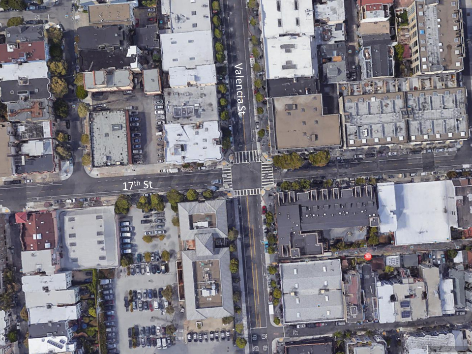
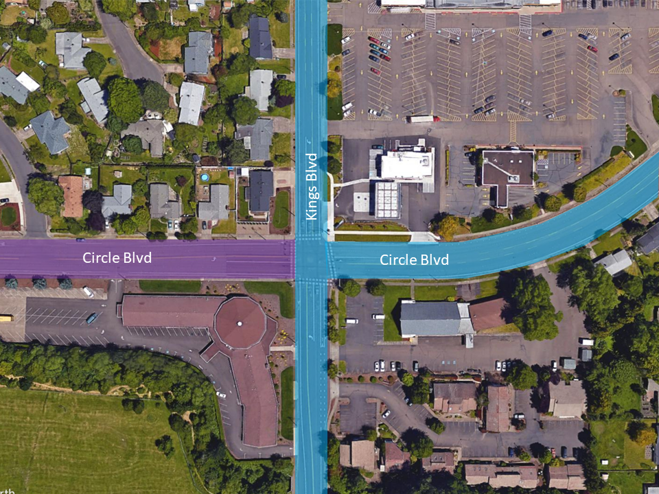
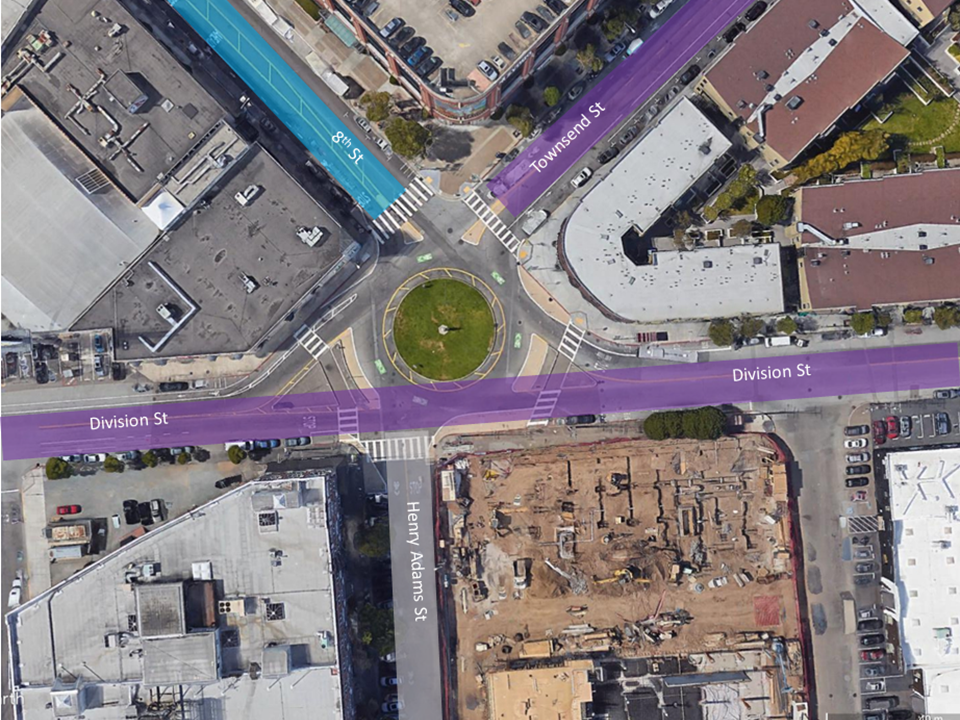

### Segment Area

_Segment Areas_ are uniquely defined (and required) by parameters _Segment Area Name_, _Functional Classification_, _State_, and _County_.

## Linear Roadway
A typical _Segment Area_ extends along a road or pathway until a user is able to change their direction of travel.

## Intersections
The name of the segment should start with the road name from where the count originates. The second part of the segment name is the road name of the intersection. There are several instances where an intersection can have more than two unique _Segment Areas_:

### Example 2
There are two _Segment Areas_ at the intersection of 17th St and Valencia St. If bicyclists are being counted on Valencia St either continuing travel on Valencia St or turning onto 17th St. The _Segment Area Name_ would be "Valencia St & 17th St" (Fig. 1). If bicyclists are being counted on 17th St and are either continuing to travel on 17th St or turning onto Valencia St, the _Segment Area Name_ would be "17th St & Valencia St".

<figure align = "center">

<figcaption>Fig 1. 17th St & Valencia St, San Francisco, California.</figcaption>
</figure>  

### Example 3
There are three _Segment Areas_ at the intersection of Circle Blvd and Kings Blvd because the _Functional Classification_ of Circle Blvd changes from "Minor Collector" to "Minor Arterial" (Fig. 2).

<figure align="center">

<figcaption>Fig 2. Circle Blvd & Kings Blvd, Corvallis, Oregon. The highlighted blue area represents "Minor Arterial" and the highlighted purple area represents "Major Collector".</figcaption>
</figure>

The name of the segment should start with the road name from where the count originates and include the direction of travel. The second part of the segment name is the road name of the intersection. The three segment names for Example 2 are:
- Circle Blvd - W & Kings Blvd
- Circle Blvd - E & Kings Blvd
- Kings Blvd & Circle Blvd

Where, "Circle Blvd - W & Kings Blvd" refers to Circle Blvd with the _Functional Classification_ "Minor Arterial"; and "Circle Blvd - E & Kings Blvd" refers to Circle Blvd with the _Functional Classification_ of "Major Collector".

### Example 4
There are 12 _Segment Areas_ where 8th St, Townsend St, Division St, and Henry Adams St intersect around a roundabout. Division St and Townsend St are both "Major Collectors", 8th St is a "Minor Arterial", and Henry Adams St is a "Local" road (Fig. 3)

<figure align="center">

<figcaption>Fig 3. A five way roundabout in San Francisco, California. The highlighted blue area represents "Minor Arterial", the highlighted purple area represents "Major Collector", and the highlighted gray area represents "Local" functional classes.</figcaption>
</figure>

The 12 segment names for Example 3 are:
- Division St & Henry Adams St
- Division St & Townsend St
- Division St & 8th St
- Henry Adams St & Division St
- Henry Adams St & Townsend St
- Henry Adams St & 8th St
- Townsend St & 8th St
- Townsend St & Division St
- Townsend St & Henry Adams St
- 8th St & Townsend St
- 8th St & Division St
- 8th St & Henry Adams St
